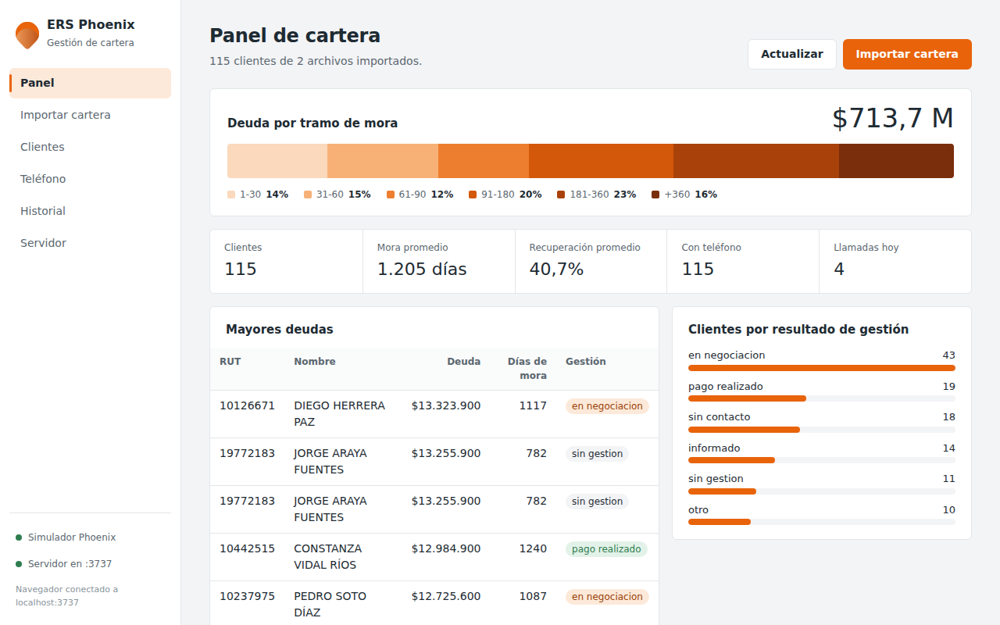

# ERS Phoenix — App de escritorio (Electron + TypeScript + SQLite)

Sistema de gestión de cartera: importa carteras en **Excel o CSV**, muestra la
deuda por tramo de mora, permite buscar clientes y **llamarlos desde un
teléfono Android** (Phoenix Mobile) conectado por Wi‑Fi. Funciona como app de
escritorio y como **servidor** para que otros equipos la usen desde el navegador.



> Versión 0.2.0. Qué cambió respecto a la 0.1.0: [`docs/CAMBIOS.md`](docs/CAMBIOS.md).
> Cómo se integraron los proyectos y la arquitectura: [`docs/INTEGRACION.md`](docs/INTEGRACION.md).

## Requisitos

- Node.js 18 o superior (https://nodejs.org)
- Para Phoenix Mobile: Android Studio y un teléfono Android 8 o superior

## Instalación de Node.js y npm

El proyecto requiere Node.js para instalar las dependencias, compilar TypeScript y ejecutar Electron. npm se instala automáticamente junto con Node.js.

En un computador nuevo con Windows, abrir PowerShell y ejecutar:

```powershell
winget install OpenJS.NodeJS.LTS

## Instalación (primera vez)

Abre PowerShell en esta carpeta y ejecuta:

```powershell
npm install
```

Esto instala Electron, better-sqlite3 (base de datos local) y xlsx (lectura de
Excel). Puede tardar uno o dos minutos. No se agregaron dependencias nuevas en
la versión 0.2.0.

## Ejecutar

| Comando | Qué hace |
|---|---|
| `npm start` | Compila y abre la app (también inicia el servidor en `http://localhost:3737`) |
| `npm run servidor` | Sólo el backend, sin ventana (base en `./datos/`) |
| `npm run simulador-movil` | Simula Phoenix Mobile para probar llamadas sin teléfono |
| `npm run prueba` | 29 pruebas automáticas del cargador CSV/XLSX |
| `npm run ejemplos` | Regenera los archivos de `ejemplos/` (datos ficticios) |
| `npm run dist` | Genera el instalador `.exe` en `release/` |

Con la app instalada, `"ERS Phoenix.exe" --servidor` deja ese PC como servidor
central sin abrir ventana.

## Uso

1. **Importar cartera**: arrastra un `.xlsx`, `.xls`, `.ods`, `.csv`, `.tsv` o
   `.txt` a la ventana (o elígelo). Antes de cargar verás qué columnas se
   reconocieron, cuántas filas hay y una muestra. En CSV el separador y la
   codificación (UTF-8 o la de Excel en Windows) se detectan solos.
2. **Panel**: deuda por tramo de mora, indicadores, mayores deudas y resultado
   de gestión.
3. **Clientes**: busca por RUT o nombre; pulsa un teléfono para llamar desde
   Phoenix Mobile. Cada llamada queda registrada.
4. **Teléfono**: escribe la IP que muestra Phoenix Mobile y prueba la conexión.
5. **Historial**: archivos importados por hoja.
6. **Servidor**: estado, URLs de acceso y opción para permitir otros equipos.

## Dónde queda guardada la información

La base SQLite (`phoenix_local.db`) se crea sola la primera vez, en la carpeta
de datos de usuario de Windows (`C:\Users\TuUsuario\AppData\Roaming\ers-phoenix\`).
Cada usuario tiene su copia local (RNF-13/RNF-18). Las bases creadas con la
versión 0.1.0 se actualizan solas, sin perder datos.

## Estructura del proyecto

```
src/
├── main.ts                    Proceso principal: ventana, IPC, servidor
├── preload.ts                 Puente seguro ventana ↔ backend (window.phoenixAPI)
├── tipos/contratos.d.ts       Tipos compartidos backend/frontend          (nuevo)
├── ipc/manejadoresIpc.ts      Canales IPC (originales + nuevos)           (nuevo)
├── servicios/                 Lógica compartida por IPC y HTTP            (nuevo)
│   ├── servicioCartera.ts
│   └── servicioMovil.ts
├── servidor/                  Arquitectura cliente-servidor               (nuevo)
│   ├── servidorHttp.ts          API REST + interfaz web
│   ├── gestorServidor.ts        Inicio/reinicio dentro de Electron
│   └── standalone.ts            Backend sin ventana
├── movil/clienteMovil.ts      Conexión con Phoenix Mobile                 (nuevo)
├── db/
│   ├── schema.sql               Esquema (+ tabla configuracion e índices)
│   ├── conexion.ts              Abre/crea la base SQLite
│   ├── consultas.ts             Consultas del panel, clientes y llamadas
│   └── configuracion.ts         Preferencias clave/valor                  (nuevo)
├── importacion/
│   ├── lectorArchivos.ts        Cargador unificado CSV/XLSX               (nuevo)
│   ├── previsualizador.ts       Vista previa antes de importar            (nuevo)
│   ├── mapeoColumnas.ts         Alias de columnas → campo interno (RF-09)
│   ├── normalizador.ts          Texto/números/fechas/RUT (RF-10, RF-12)
│   ├── calculos.ts              Días de mora, % recuperación (RF-32, RF-33)
│   ├── clasificador.ts          Categoría de gestión (RF-34)
│   └── importador.ts            Orquesta todo y escribe en SQLite
└── renderer/
    ├── index.html               Interfaz (6 vistas)
    ├── styles.css               Paleta naranja/blanco (RNF-04)
    ├── api.ts                   Mismo frontend por IPC o HTTP             (nuevo)
    └── renderer.ts              Lógica de la interfaz
movil/                         Phoenix Mobile (Android) y prototipo Python
scripts/                       Build, servidor, simulador, ejemplos
pruebas/                       Pruebas del cargador
ejemplos/                      Archivos de cartera ficticios
docs/                          Cambios, integración, capturas y patch
```

## Próximos pasos sugeridos

- Evitar duplicados al reimportar el mismo archivo (upsert por RUT).
- Módulo de login (RF-01 a RF-07) y asociar importaciones/llamadas al ejecutivo.
- Registrar el resultado de la llamada (contestó, compromiso, etc.) después de colgar.
- Agregar al mapeo las columnas que aparezcan como "ignoradas" al probar con
  `Cartera_MAYO_Diego_Cruz.xlsx` y `Cartera_Diego_Julio-1.xlsx`.
