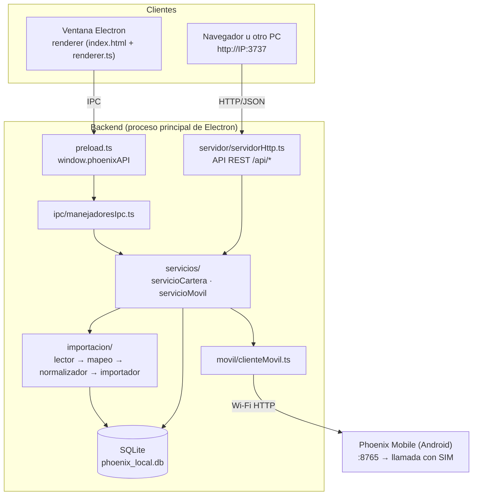
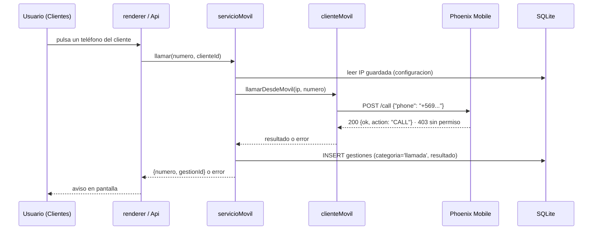

# Cómo se integraron los proyectos

## 1. Punto de partida

| Proyecto | Tecnología | Qué hacía |
|---|---|---|
| `PRUEBA_IMPORT_EXCEL` | Electron 31 + TypeScript + SQLite (better-sqlite3) + SheetJS | Importaba Excel de cartera, normalizaba y mostraba un resumen |
| `CONEXION_PC_A_ANDROID` / Android | Kotlin, servidor HTTP propio en el puerto 8765 | Recibe un número por Wi‑Fi y llama con la SIM (`ACTION_CALL`) |
| `CONEXION_PC_A_ANDROID` / PC | Python + Tkinter | Ventana de prueba: hace `GET /ping` y `POST /call` al teléfono |

La base que manda es la de Electron. El cliente Python se **tradujo a
TypeScript** dentro del backend (mismo protocolo, mismo puerto, mismo timeout),
así que la app Android no necesitó cambios.

## 2. Arquitectura resultante



La interfaz es **la misma** en los dos clientes: `renderer/api.ts` detecta si
existe `window.phoenixAPI` (Electron → IPC) o no (navegador → `fetch('/api/…')`).

### Capas y responsabilidades

| Capa | Carpeta | Regla |
|---|---|---|
| Presentación | `src/renderer/` | Sólo llama al objeto `Api`. Nunca toca la base |
| Entrada | `src/ipc/`, `src/servidor/` | Traducen IPC/HTTP a llamadas de servicio. Sin lógica de negocio |
| Servicios | `src/servicios/` | Única capa que combina importación, consultas y teléfono |
| Dominio | `src/importacion/`, `src/movil/` | Funciones puras o con una sola responsabilidad |
| Datos | `src/db/` | SQL y conexión |

## 3. Flujo del cargador CSV / XLSX

```mermaid
flowchart LR
    A[Archivo .xlsx/.xls/.ods<br/>.csv/.tsv/.txt] --> B{lectorArchivos}
    B -- Excel --> B1[SheetJS<br/>mismas opciones v0.1.0]
    B -- Texto --> B2[decodificarTexto<br/>UTF-8 / UTF-16 / Windows-1252]
    B2 --> B3[detectarSeparador<br/>; , tab |  sep=]
    B3 --> B4[parsearCsv RFC 4180]
    B4 --> B5[matrizAObjetos]
    B1 --> T[Tablas comunes<br/>filas {encabezado: valor}]
    B5 --> T
    T --> PV[previsualizador<br/>columnas reconocidas + muestra]
    T --> IM[importador<br/>mapearFilas → normalizar → calcular → clasificar → SQLite]
```

1. El usuario elige o arrastra el archivo.
2. **Vista previa** (no escribe nada): formato, separador, codificación, filas por
   hoja, columnas reconocidas (verde, con el campo destino) e ignoradas (gris),
   filas sin RUT y 8 filas de muestra.
3. **Importar**: el mismo importador de la v0.1.0, dentro de una transacción por hoja.

Para que una columna nueva se cargue, agrégala en `MAPEO_COLUMNAS`
(`src/importacion/mapeoColumnas.ts`) en MAYÚSCULAS y sin tildes.

## 4. Flujo de una llamada



## 5. Contratos

### IPC (`window.phoenixAPI`, definido en `preload.ts`)

| Método | Canal | Desde |
|---|---|---|
| `elegirArchivoExcel()` / `elegirArchivoCartera()` | `dialogo:elegir-excel` | v0.1.0 |
| `importarExcel(ruta)` / `importarArchivo(ruta)` | `importacion:ejecutar` | v0.1.0 |
| `obtenerResumen()` | `resumen:obtener` | v0.1.0 |
| `obtenerHistorial()` | `importaciones:historial` | v0.1.0 |
| `previsualizarArchivo(ruta)` | `importacion:previsualizar` | v0.2.0 |
| `rutaDeArchivo(file)` | — (`webUtils`) | v0.2.0 |
| `listarClientes(filtro)` / `listarCategorias()` | `clientes:listar` / `clientes:categorias` | v0.2.0 |
| `obtenerMovil()` / `probarMovil(ip?)` / `llamarMovil(n, id?)` / `listarLlamadas()` | `movil:*` | v0.2.0 |
| `estadoServidor()` / `configurarServidor(cfg)` | `servidor:*` | v0.2.0 |
| `abrirExterno(url)` | `sistema:abrir-externo` | v0.2.0 |

Los canales nuevos responden `{ ok: true, datos }` o `{ ok: false, error }`.

### HTTP (`servidorHttp.ts`)

Todas las rutas `/api/*` exigen la cabecera `X-Phoenix-Cliente` (protección
CSRF) y, si se definió `PHOENIX_TOKEN`, `Authorization: Bearer <token>`.

| Método | Ruta | Cuerpo |
|---|---|---|
| GET | `/api/salud` | — |
| GET | `/api/resumen` | — |
| GET | `/api/historial` | — |
| GET | `/api/clientes?texto=&categoria=&pagina=&porPagina=` | — |
| GET | `/api/categorias` | — |
| POST | `/api/importar/previsualizar` | bytes del archivo + cabecera `X-Nombre-Archivo` |
| POST | `/api/importar` | bytes del archivo + cabecera `X-Nombre-Archivo` |
| GET | `/api/movil` | — |
| POST | `/api/movil/probar` | `{ "ip": "192.168.1.25" }` (JSON) |
| POST | `/api/movil/llamar` | `{ "numero": "+569...", "clienteId": 42 }` (JSON) |
| GET | `/api/movil/llamadas` | — |
| GET | `/api/servidor` | — |

Ejemplo con curl:

```bash
curl -H "X-Phoenix-Cliente: curl" http://localhost:3737/api/resumen
curl -H "X-Phoenix-Cliente: curl" -H "X-Nombre-Archivo: cartera.csv" \
     --data-binary @cartera.csv http://localhost:3737/api/importar
```

### Protocolo Phoenix Mobile (sin cambios)

| Método | Ruta | Respuesta |
|---|---|---|
| GET | `:8765/ping` | `{ ok, app, directCall, callPermission, device }` |
| POST | `:8765/call` `{ phone }` | `{ ok, phone, action: "CALL" }` · 400 · 403 · 404 · 500 |

## 6. Tres formas de ejecutar

| Modo | Comando | Para qué |
|---|---|---|
| App de escritorio | `npm start` | Uso normal. Inicia también el servidor en `localhost:3737` |
| Sólo backend (desarrollo) | `npm run servidor` | Montar el backend sin ventana; base en `./datos/` |
| Sólo backend (instalado) | `"ERS Phoenix.exe" --servidor [--puerto=3737]` | PC central con el mismo instalador; escucha en la red |

Variables de entorno del backend: `PHOENIX_PUERTO`, `PHOENIX_RED` (`1`/`0`),
`PHOENIX_DB`, `PHOENIX_TOKEN`.

> **Firewall de Windows:** la primera vez que actives "Permitir acceso desde
> otros equipos" Windows preguntará si permites la conexión. Acepta en redes
> privadas.

## 7. Prueba en tu equipo

```powershell
npm install                 # instala y recompila better-sqlite3 para Electron
npm run prueba              # 29 pruebas del cargador
npm start                   # abre la app
```

Sin teléfono: en otra terminal `npm run simulador-movil`, y en la app,
sección **Teléfono**, escribe `127.0.0.1` y pulsa «Probar conexión».

Con teléfono real: abre `movil/android` en Android Studio, ejecuta en el
teléfono, acepta el permiso y escribe en la app la IP que muestra Phoenix Mobile.

Archivos de prueba: `ejemplos/` (datos ficticios). Para regenerarlos:
`npm run ejemplos`.

## 8. Depurar en VS Code

`.vscode/launch.json` trae dos configuraciones:

- **Depurar app Electron**: compila y abre la app con puntos de interrupción en `src/**/*.ts` (gracias a `sourceMap`).
- **Depurar servidor independiente**: lo mismo para `standalone.ts`.

Al pasar el mouse sobre cualquier función exportada verás su documentación
(JSDoc: descripción, parámetros, retorno y ejemplo).
